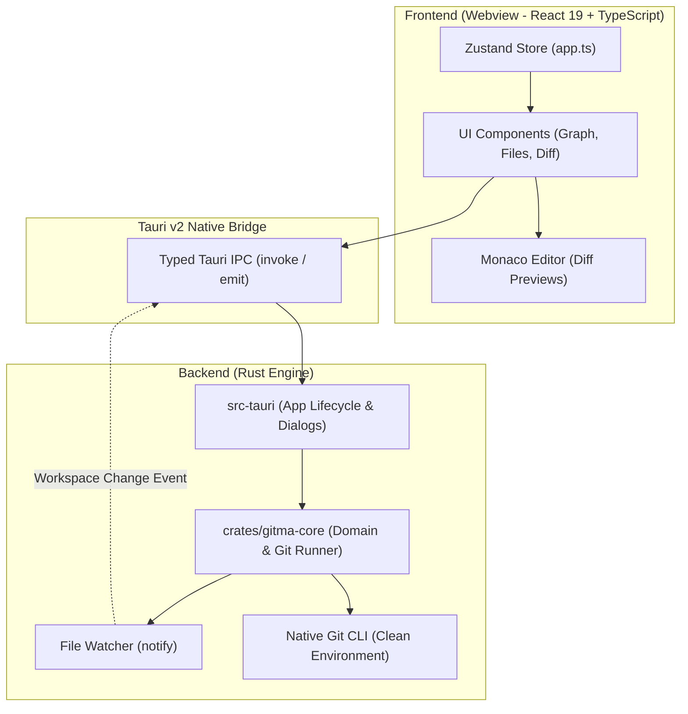

# Gitma Architecture & Design

This document details the architectural principles, module boundaries, data flows, and design rationale of **Gitma**.

---

## 🏛️ High-Level Architectural Model

Gitma is designed as a hybrid desktop application combining the memory safety and processing speed of **Rust** with the flexibility and expressiveness of **React & TypeScript**, bound together by **Tauri v2**.

---

## 🧩 Component Breakdown

### 1. `crates/gitma-core` (The Rust Engine)
This crate contains all core business logic and is completely independent of any UI or desktop frameworks:
- **`git/runner.rs`**: Safe, controlled execution of native Git commands. Prevents hanging by running with `GIT_TERMINAL_PROMPT=0` and non-interactive environments.
- **`git/history.rs`**: Extracts commit logs, traverses topological parent hierarchies, parses refs, and isolates internal stash commits.
- **`graph/layout.rs`**: Fast lane allocation algorithm for drawing the interactive commit DAG (Directed Acyclic Graph) in constant linear space.
- **`git/operations.rs`**: High-level Git workflows:
  - Branching (`create`, `switch`, `delete`, `delete_remote`).
  - Merging (`merge`, `merge_squash`).
  - Rebase lifecycle (`continue`, `abort`, in-progress detection).
  - Stash management (`push`, `pop`, `apply`, `drop`, multi-stash indexing).
  - Reset (`soft`, `mixed`, `hard`).
  - Revert and Cherry-pick.
  - Discarding changes (`checkout --` / `clean -fd`).
  - Tagging (`create`, `delete`).
- **`backend.rs`**: Workspace session management, debounced file watcher (`notify`), and diff preview generator with binary detection and line count limits.

### 2. `src-tauri` (The Native Desktop Host)
- Connects Tauri's IPC interface with `gitma-core`.
- Manages desktop window preferences, native folder picker dialogs (`tauri-plugin-dialog`), and system tray / title bar integration.
- Strictly validates incoming arguments and maps Rust errors to client-readable error strings.

### 3. `ui` (The User Interface)
- **`store/app.ts`**: Single centralized reactive state store powered by Zustand:
  - Active workspace and multi-repo tabs.
  - Tab color groups and reordering.
  - Commit history and selection.
  - Working directory status (staged, unstaged, untracked, conflicts).
  - Active file diff models and caching.
- **`components/GraphPanel.tsx`**: High-performance virtualized commit table (`@tanstack/react-virtual`), SVG graph bezier lanes, commit search/filter, and branch ref badges.
- **`components/FilesPanel.tsx`**: Local changes tree/list, staging checkboxes, discard buttons, and commit creation form.
- **`components/DiffPanel.tsx`**: Monaco Editor diff viewer with side-by-side vs. inline modes, syntax highlighting for 80+ programming languages, and "only changes" folding.
- **`components/TabBar.tsx`**: Multi-repository navigation with color grouping, drag-and-drop ordering, and inline renaming.
- **Context Menus & Modals**: Portal-rendered (`createPortal(..., document.body)`) menus with viewport collision detection (`ContextMenu`, `RefPopover`, `ResetModal`, `CreateTagModal`).

---

## 🔒 Security & Privacy Guarantees

1. **Zero External Network Calls**:
   - Gitma has no analytics, no telemetry, and no remote dependencies.
   - Remote interactions (`fetch`, `pull`, `push`) strictly communicate with the Git remotes configured in the user's repository via the native `git` binary.
2. **Safe Credential Handling**:
   - Gitma does not intercept, store, or log SSH keys, passwords, or personal access tokens.
   - All authentication relies on the user's native Git credential helpers and SSH agents.
3. **Strict Content Security Policy (CSP)**:
   - Configured in `src-tauri/tauri.conf.json` to prevent inline script injection or unexpected resource loading.
